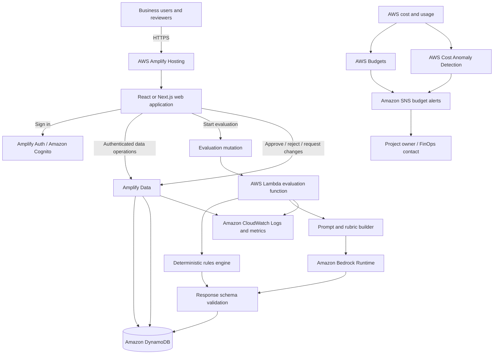
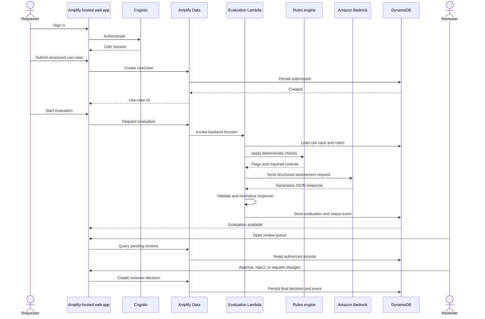
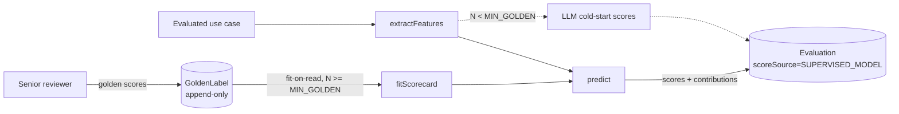
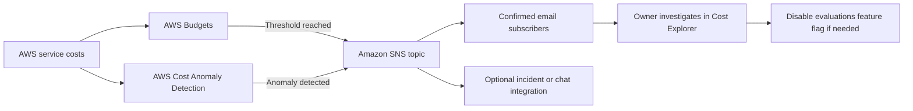
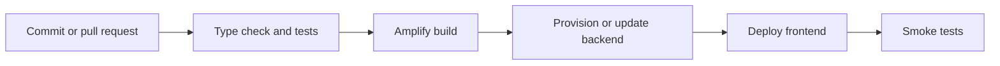

# Enterprise GenAI Use-Case Decision Platform — MVP Architecture

**Status:** Proposed  
**Audience:** Engineering, architecture, security, product, and executive stakeholders  
**Target:** AWS Amplify Gen 2  
**Last updated:** 2026-07-16

---

## 1. Purpose

This document describes the architecture for an MVP that helps an organization submit, assess, review, and govern proposed generative-AI use cases.

The MVP is designed to demonstrate a complete business workflow:

1. A requester submits a structured GenAI use case.
2. The platform applies deterministic policy checks.
3. Amazon Bedrock produces a structured decision-support assessment.
4. A reviewer approves, rejects, or requests changes.
5. The platform preserves the assessment, final decision, comments, and status history.

The platform is a **decision-support system**. The generated assessment does not replace accountable human review for security, privacy, legal, compliance, HR, or other high-impact decisions.

---

## 2. MVP goals

The MVP must:

- Provide authenticated Requester and Reviewer experiences.
- Capture structured GenAI use-case proposals.
- Evaluate proposals against a stable scoring rubric.
- Produce explainable, machine-validated assessment results.
- Identify missing information and required controls.
- Route assessments to a human reviewer.
- Record the final human decision and review comments.
- Present a dashboard of use cases, scores, and statuses.
- Be deployable from the GitHub repository through AWS Amplify.
- Use managed and serverless AWS services wherever practical.
- Monitor AWS spend against an explicit monthly budget.
- Alert the project owner before and after forecast or actual spend exceeds configured thresholds.
- Detect unusual service-level spending that may not be visible from a simple monthly threshold.
- Be sufficiently polished and reliable for a senior-stakeholder demonstration.

### Non-goals

The first MVP will not provide:

- Autonomous approval of enterprise projects.
- A comprehensive policy or regulatory compliance engine.
- Full enterprise SAML federation.
- Jira, ServiceNow, Slack, or Microsoft Teams integration.
- Multi-region availability.
- Complex multi-tenant billing.
- Fine-tuned foundation models.
- Bedrock Agents or autonomous tool selection.
- A production-scale RAG platform.
- Aurora, ECS, EKS, or other continuously running compute.
- A public external API.

---

## 3. Architecture principles

1. **Build one complete vertical workflow.**  
   Optimize for a reliable end-to-end demo rather than broad service coverage.

2. **Human decision remains authoritative.**  
   The AI assessment is advisory and is stored separately from the final reviewer decision.

3. **Structured input and structured output.**  
   The system uses defined fields, deterministic rules, a versioned rubric, and JSON-schema validation.

4. **Least privilege.**  
   Each function receives only the permissions required for its task.

5. **Traceability by default.**  
   Every assessment records model, prompt, rubric, rule, and workflow versions.

6. **Serverless first.**  
   Use Amplify-managed resources, Lambda, DynamoDB, and Bedrock to reduce MVP operational overhead.

7. **No secrets in the repository or browser.**  
   Model access and privileged operations occur only in backend resources.

---

## 4. High-level architecture



### Primary request flow



---

## 5. AWS service responsibilities

| Capability | AWS service | MVP responsibility |
|---|---|---|
| Web delivery | AWS Amplify Hosting | Build and deploy the frontend from GitHub, manage branches, and serve the application over HTTPS |
| Authentication | Amplify Auth / Amazon Cognito | Sign-in, sessions, password recovery, and role/group claims |
| API and data | Amplify Data | Typed application API, authorization rules, queries, mutations, and subscriptions where useful |
| Persistence | Amazon DynamoDB | Use cases, evaluations, decisions, comments, rubric versions, and status events |
| Backend compute | Amplify Functions / AWS Lambda | Deterministic checks, Bedrock calls, validation, and protected business operations |
| Model inference | Amazon Bedrock Runtime | Generate a structured decision-support assessment |
| Files, optional | Amplify Storage / Amazon S3 | Store a small set of approved policy documents or use-case attachments |
| Monitoring | Amazon CloudWatch | Backend logs, error metrics, duration, throttling, and alarms |
| Audit support | AWS CloudTrail | Record AWS control-plane activity |
| Encryption | AWS-managed encryption initially | Encryption at rest for managed services; customer-managed KMS keys may be added later |
| Email, optional | Amazon SES | Reviewer notification after the core in-app workflow is stable |
| Budget monitoring | AWS Budgets | Track monthly actual and forecast spend and evaluate alert thresholds |
| Cost alerts | Amazon SNS | Deliver budget and anomaly notifications to the project owner or team |
| Anomaly detection | AWS Cost Anomaly Detection | Detect unusual service-level spend independently of the fixed monthly budget |
| Cost analysis | AWS Cost Explorer | Investigate spend by service, account, region, and tag |

---

## 6. Recommended repository structure

```text
.
├── amplify/
│   ├── auth/
│   │   └── resource.ts
│   ├── data/
│   │   └── resource.ts
│   ├── functions/
│   │   └── evaluate-use-case/
│   │       ├── handler.ts
│   │       ├── resource.ts
│   │       ├── prompt.ts
│   │       ├── rules.ts
│   │       ├── schemas.ts
│   │       └── types.ts
│   ├── storage/
│   │   └── resource.ts
│   ├── cost-controls/
│   │   ├── budget.ts
│   │   ├── notifications.ts
│   │   └── anomaly-detection.ts
│   └── backend.ts
├── src/
│   ├── app/
│   ├── components/
│   ├── features/
│   │   ├── auth/
│   │   ├── use-cases/
│   │   ├── evaluations/
│   │   ├── reviews/
│   │   └── dashboard/
│   ├── lib/
│   │   ├── amplify-client.ts
│   │   ├── authorization.ts
│   │   └── validation.ts
│   └── types/
├── docs/
│   ├── architecture.md
│   ├── evaluation-rubric.md
│   ├── demo-script.md
│   └── threat-model.md
├── tests/
│   ├── unit/
│   ├── integration/
│   └── e2e/
├── package.json
└── README.md
```

This file may live at either `/architecture.md` or `/docs/architecture.md`. The repository should use one location consistently.

---

## 7. User roles and authorization

### Requester

A Requester can:

- Create a use case.
- Read use cases they own.
- Edit a draft.
- Submit a use case for evaluation.
- Read generated evaluations for their use cases.
- Respond to requested changes.
- Read the final reviewer decision.

A Requester cannot:

- Review or decide another user's proposal.
- Change an AI assessment after it is generated.
- Assign themselves reviewer privileges.
- invoke Bedrock directly from the browser.

### Reviewer

A Reviewer can:

- Read submitted use cases.
- Read generated evaluations.
- Add reviewer comments.
- Approve, reject, or request changes.
- Read the review history.

A Reviewer cannot:

- Alter the stored AI output.
- Alter the rubric version associated with a completed evaluation.
- erase prior decisions or status events through the application.

### Senior Reviewer

A Senior Reviewer is a trusted subset of reviewers (Cognito group `SENIOR_REVIEWER`) authorized to record **golden labels** — human scores treated as absolute truth for the supervised scoring model (§9.5).

A Senior Reviewer can do everything a Reviewer can, and additionally:

- Record a golden label (five dimension scores plus an optional recommendation) for an evaluated use case.

A Senior Reviewer cannot:

- Edit or delete a golden label once written. Golden labels are **append-only** (create/read only) so the training signal cannot be silently rewritten.
- Record more than one golden label for the same use case (enforced in the UI; the model tolerates duplicates by treating each as an independent sample).

Golden labelling is deliberately restricted to a senior group because these scores become ground truth. Membership is managed by an Administrator, never self-assigned.

### Administrator

Administration is intentionally limited in the MVP. An Administrator may:

- Manage demo users and groups.
- Activate a rubric version.
- View operational errors.
- Seed demonstration data.

Authorization must be enforced in the backend and data model. Hiding a control in the frontend is not an authorization boundary.

---

## 8. Data model

The following logical model can be implemented with Amplify Data. Amplify will provision and manage the backing data infrastructure.

### UserProfile

```text
id
email
displayName
role
organization
createdAt
updatedAt
```

### UseCase

```text
id
ownerId
title
businessProblem
targetUsers[]
expectedOutcome
successMetrics[]
proposedCapability
dataSources[]
dataClassification
externalFacing
humanOversight
estimatedMonthlyVolume
riskConcerns
status
currentEvaluationId
createdAt
updatedAt
submittedAt
```

Recommended statuses:

```text
DRAFT
SUBMITTED
EVALUATING
EVALUATION_FAILED
PENDING_REVIEW
CHANGES_REQUESTED
APPROVED
REJECTED
ARCHIVED
```

### Evaluation

```text
id
useCaseId
recommendation
overallScore
summary
scores
recommendedPattern
requiredControls[]
missingInformation[]
policyReferences[]
deterministicFlags[]
scoreSource            # SUPERVISED_MODEL | LLM_COLDSTART (§9.5)
features               # structured feature snapshot used for scoring
featureContributions   # per-dimension active feature effects (the "why")
goldenSampleCount      # golden labels the supervised model was fit from
modelId
modelConfiguration
promptVersion
rubricVersion
rulesVersion
rawResponseLocation
createdAt
```

The `scoreSource`, `features`, `featureContributions`, and `goldenSampleCount` fields support the supervised scoring feedback loop (§9.5). They record whether the five dimension scores were produced by the fitted supervised model or the LLM cold-start fallback, the exact feature vector scored, the explanation for each dimension, and how much golden data the model had.

Recommended recommendations:

```text
PROCEED
PROCEED_WITH_CONTROLS
REVISE_AND_RESUBMIT
DO_NOT_PROCEED
SPECIALIST_REVIEW_REQUIRED
```

### ReviewerDecision

```text
id
useCaseId
evaluationId
reviewerId
decision
comment
conditions[]
createdAt
```

### GoldenLabel

Senior human scores treated as absolute truth for the supervised scoring model (§9.5). Append-only: create/read only, so a golden label is never rewritten once recorded.

```text
id
useCaseId
features               # structured feature snapshot at label time
scores                 # five dimension scores (0-100) assigned by the senior
overallScore           # arithmetic mean of the five scores
recommendation         # optional senior recommendation
scoredBy               # senior reviewer subject id
notes                  # optional rationale
createdAt
```

Authorization: `SENIOR_REVIEWER` and `ADMIN` may create and read; all authenticated users may read (so the Evaluation card and the client-side model preview can use golden data). There is no update or delete grant.

### Comment

```text
id
useCaseId
authorId
body
visibility
createdAt
```

### StatusEvent

```text
id
useCaseId
actorId
actorType
fromStatus
toStatus
eventType
detail
createdAt
```

### RubricVersion

```text
id
version
name
description
criteria
thresholds
isActive
createdAt
```

---

## 9. Evaluation design

### 9.1 Scoring categories

The initial rubric should use five categories:

| Category | Purpose |
|---|---|
| Business value | Measures value, strategic alignment, measurable outcomes, and user benefit |
| Technical feasibility | Measures implementation complexity, integration readiness, and operational viability |
| Data readiness | Measures data availability, quality, permissions, classification, and lifecycle |
| Security and privacy risk | Measures exposure, sensitive data, access, retention, and external processing risk |
| Responsible-AI risk | Measures impact on people, fairness, explainability, human oversight, and misuse potential |

Scores should use a 0–100 scale, with explicit anchors in `docs/evaluation-rubric.md`.

### 9.2 Deterministic rules

Deterministic checks run before the model call. Initial examples:

| Condition | Result |
|---|---|
| High-impact decision about employment, credit, health, legal rights, or access to essential services | Require specialist review |
| External-facing generated content with no human oversight | Require human review control |
| Restricted data with an unapproved processing path | Block or require security review |
| No measurable outcome | Request additional information |
| No approved data source | Lower data-readiness score and restrict recommendation to discovery/prototype |
| Automated action without rollback or escalation | Require operational control |
| Personal data with no stated retention period | Require privacy review |
| User-provided documents sent to the model without validation | Require file validation and prompt-injection controls |

Rules must be versioned. Each evaluation stores the exact rules version.

### 9.3 Model output contract

The backend must require a structured response matching this shape:

```json
{
  "recommendation": "PROCEED_WITH_CONTROLS",
  "overallScore": 78,
  "summary": "The use case has strong value and feasible implementation, but requires controls for personal data and customer-facing output.",
  "scores": {
    "businessValue": 88,
    "technicalFeasibility": 82,
    "dataReadiness": 70,
    "securityAndPrivacyRisk": 62,
    "responsibleAiRisk": 66
  },
  "recommendedPattern": "Internal retrieval-augmented assistant",
  "requiredControls": [
    "Restrict access to authorized users",
    "Redact personal information before inference",
    "Require human review before external publication",
    "Show sources with generated responses"
  ],
  "missingInformation": [
    "Expected monthly request volume",
    "Confirmed retention period"
  ],
  "policyReferences": [
    {
      "title": "AI Acceptable Use Policy",
      "section": "Human oversight",
      "referenceId": "policy-ai-001"
    }
  ]
}
```

The Lambda function must:

1. Parse the response.
2. Validate it against a local schema.
3. Reject unknown recommendation values.
4. Bound all scores to the expected range.
5. Combine deterministic controls with generated controls.
6. Remove duplicate controls.
7. Store a normalized record.
8. Return a controlled error if validation fails.

The browser must never save unvalidated model output directly.

### 9.4 Model configuration

The model identifier and inference parameters must be configured in backend environment variables, not hard-coded throughout the application.

Example configuration:

```text
BEDROCK_MODEL_ID=<approved-model-or-inference-profile-id>
PROMPT_VERSION=1.0.0
RUBRIC_VERSION=1.0.0
RULES_VERSION=1.0.0
```

Use conservative inference settings to improve repeatability. The exact model choice depends on region availability, organizational approval, cost, latency, and required quality.

### 9.5 Supervised scoring feedback loop

The platform learns to score like its senior reviewers. Senior human scores are captured as **golden labels** (absolute truth), structured features are extracted from each use case, and an interpretable model learns a feature→score mapping so future AI scores track senior judgement and can explain *why* a score is what it is.

This is a deliberate application of supervised learning where the label is the senior's score and the goal is not just accuracy but **explainability**.

#### Scoring authority

- **Supervised model leads when it has enough data.** When at least `MIN_GOLDEN` (= 3) golden samples exist, the five dimension scores are produced by the supervised model (`scoreSource = SUPERVISED_MODEL`).
- **Cold start falls back to the LLM.** Below `MIN_GOLDEN`, the LLM's scores are used (`scoreSource = LLM_COLDSTART`).
- **Overall score is deterministic.** `overallScore` is always the arithmetic mean of the five dimension scores, regardless of source — explainable and reproducible.
- **The LLM still owns the qualitative output** in both modes: summary, recommended pattern, recommendation (subject to the deterministic recommendation floor of §9.2), required controls, missing information, and policy references. The AI recommendation and the human decision remain stored separately (ADR-007).

#### Features (structured only)

Features are derived only from structured form fields and deterministic-rule hits — **no extra Bedrock call** is made to derive semantic features. This keeps extraction free, deterministic, reproducible, and explainable, and lets the identical code run in the Lambda (fit-on-read) and in the browser (framework preview). Every feature is binary (0/1). Examples:

- `dataClassification` one-hot (`dc_PUBLIC` … `dc_RESTRICTED`).
- `externalFacing`, `humanOversight`, `hasSuccessMetrics`.
- Data-source count buckets (`ds_none` / `ds_few` / `ds_many`).
- Estimated-volume buckets (`vol_unknown` / `vol_low` / `vol_med` / `vol_high`).
- One `rule_<ruleId>` marker per deterministic rule hit (reusing the §9.2 engine, so the model and rules never drift).

`FEATURE_CATALOG` in `amplify/functions/evaluate-use-case/features.ts` is the single source of truth for the feature space.

#### Model — interpretable weighted scorecard (feature-effect model with shrinkage)

Pure JavaScript, fit inside the Lambda; **no SageMaker, no vector store, no fine-tuning**. For each dimension `d`:

- `baseline_d = mean(golden score_d)`
- for each binary feature `f`: `effect_{d,f} = (mean(score_d | f=1) − baseline_d) × n1 / (n1 + K)`, with shrinkage constant `K = 3` and `n1` the number of positive samples for `f`.
- prediction: `score_d = clamp(round(baseline_d + Σ_{active f} effect_{d,f}), 0, 100)`.
- **contributions** = the effects of the active features → the "why this score" explanation, persisted in `featureContributions`.

**Fit-on-read:** at evaluation time the Lambda reads all golden samples (small N) from DynamoDB and fits the scorecard on the fly. There is no persisted or trained artifact and nothing to retrain or version separately; the model is always the current golden set.

#### Limitations (important)

- The model **sums marginal, one-feature-at-a-time effects — it is not a joint regression.** Correlated features can double-count. Shrinkage (`K`) damps effects estimated from few positives but does not remove collinearity.
- It needs **enough golden samples** to be trustworthy. `MIN_GOLDEN` is a floor for *activation*, not a guarantee of statistical validity; early predictions should be read as directional.
- Golden labels are **only as good as the seniors who set them**, and are treated as absolute truth by design — bias in labelling propagates into scores.
- It models scores only. Recommendation, controls, and narrative remain LLM-generated and deterministically constrained; the supervised model never widens a recommendation.

#### Data captured

Each `Evaluation` stores `scoreSource`, the `features` snapshot, `featureContributions`, and `goldenSampleCount` (§8). Each `GoldenLabel` stores the senior's `features` snapshot, `scores`, `overallScore`, optional `recommendation`, `scoredBy`, and `notes`, append-only.



---

## 10. Backend function boundaries

### `evaluate-use-case`

Responsibilities:

- Verify the authenticated caller.
- Confirm the use case is in an evaluable state.
- Load the use case.
- Apply deterministic rules.
- Construct the assessment request.
- Call Amazon Bedrock.
- Validate and normalize the output.
- Persist the evaluation.
- Update use-case status.
- Create status events.
- Emit operational metrics.

The function must be idempotent. Repeated requests with the same evaluation request ID should return the existing evaluation or safely resume.

### Optional future functions

- `notify-reviewer`
- `seed-demo-data`
- `ingest-policy-document`
- `export-decision-report`

Do not split the MVP into many Lambda functions until separate scaling, security, runtime, or ownership boundaries justify it.

---

## 11. Frontend architecture

Recommended feature areas:

### Requester experience

- Sign in.
- Dashboard.
- Create use case.
- Edit draft.
- Submit for assessment.
- View assessment.
- Respond to requested changes.
- View final decision.

### Reviewer experience

- Review queue.
- Use-case detail.
- Assessment detail.
- Required controls.
- Missing information.
- Comments.
- Approve, reject, or request changes.

### Shared components

- Status badge.
- Score card.
- Risk indicator.
- Timeline.
- Policy reference.
- Required-control checklist.
- Error boundary.
- Loading and retry states.

### State management

Prefer generated Amplify clients and feature-local state. Add a global state library only when the application demonstrates a concrete need.

---

## 12. Policy references for the MVP

The first demo should use a small curated set of policy records. The platform may store these as:

1. Versioned JSON or Markdown included with the backend, or
2. Files in an Amplify Storage bucket with a small metadata index.

A production knowledge base is not required for the initial demonstration.

Suggested demo policies:

- AI acceptable-use policy.
- Data-classification standard.
- Human-oversight standard.
- Customer-communication standard.
- Security review criteria.
- Privacy and retention standard.

The model receives only relevant, approved excerpts. The application presents references as supporting context, not as proof of legal or policy compliance.

---

## 13. Security architecture

### Authentication

- Require authenticated access.
- Disable anonymous application data access.
- Use Cognito groups or claims for `REQUESTER`, `REVIEWER`, and `ADMIN`.
- Require strong password configuration for the MVP.
- Add enterprise federation after the workflow is validated.

### Authorization

- Apply owner-based access for Requesters.
- Apply group-based access for Reviewers.
- Restrict administrative operations.
- Perform sensitive state-transition checks in backend code.
- Reject attempts to review a draft or overwrite a completed decision.

### Bedrock access

- Only the evaluation Lambda role may invoke the approved model.
- Restrict IAM permissions to the selected model or inference profile where supported.
- Never expose AWS credentials or Bedrock calls to the client.
- Do not log complete sensitive prompts by default.

### Data protection

- Use HTTPS in transit.
- Use encryption at rest provided by managed AWS services.
- Avoid storing unnecessary personal or confidential data.
- Redact or tokenize highly sensitive fields before model inference when required.
- Set explicit retention rules before a production launch.
- Keep demo data synthetic.

### Input and output controls

- Validate field lengths and allowed values.
- Escape rendered user and model content.
- Treat policy text and attachments as untrusted.
- Do not execute model-generated code or actions.
- Prevent the model from changing user roles, workflow states, or permissions.
- Store AI output separately from human decisions.

### Secrets

- Do not commit credentials, access keys, tokens, or confidential policies.
- Use Amplify function environment configuration and AWS-managed secret facilities where required.
- Treat `amplify_outputs.json` as application configuration, not as a place for secrets.

---

## 14. Budget monitoring and cost controls

Cost controls are part of the MVP infrastructure and must be deployed with the application rather than configured only as an undocumented console step.

### 14.1 Monthly budget

Create an AWS Budgets **monthly cost budget** for the demo environment.

Recommended environment variables or deployment parameters:

```text
MONTHLY_BUDGET_AMOUNT=100
BUDGET_CURRENCY=USD
BUDGET_ALERT_EMAIL=owner@example.com
BUDGET_NAME=genai-decision-platform-demo
```

The amount above is an example only. The project owner must approve the real monthly limit before deployment.

Configure the following notifications:

| Threshold | Basis | Purpose |
|---|---|---|
| 50% | Actual spend | Early awareness |
| 80% | Actual spend | Investigate current usage |
| 100% | Forecast spend | Warn that the account is projected to exceed the budget |
| 100% | Actual spend | Confirm that the budget has been exceeded |
| 120% | Actual spend | Escalate an unexpected overrun |

Budget alerts should publish to an Amazon SNS topic. The SNS topic should have at least one confirmed email subscriber owned by the project team. Where the organization has a central FinOps or cloud-platform team, subscribe that team as well.

AWS Budgets notifications are not real-time circuit breakers. Billing data can be delayed, so the application must also limit costly operations directly.

### 14.2 Cost anomaly detection

Enable AWS Cost Anomaly Detection for the account or relevant linked account.

Create:

- A service-level cost monitor.
- An alert subscription routed to the same cost-alert SNS topic or approved email recipients.
- A practical minimum-impact threshold to avoid excessive low-value alerts.

Cost Anomaly Detection complements AWS Budgets:

- **AWS Budgets** answers whether total spend is approaching a planned limit.
- **Cost Anomaly Detection** identifies unusual spend patterns, including spikes in a specific service.

### 14.3 Application-level spending guardrails

The evaluation backend must implement safeguards that reduce the chance of accidental model spend:

- Allow only authenticated users to request evaluations.
- Restrict evaluation requests to the use-case owner or an authorized Reviewer/Admin.
- Prevent concurrent duplicate evaluations for the same request.
- Use an idempotency key for each evaluation attempt.
- Apply a per-user or per-use-case evaluation limit.
- Enforce maximum lengths for all submitted text.
- Enforce a maximum model output-token limit.
- Use conservative retry counts.
- Do not automatically retry schema failures without a hard cap.
- Record model ID, token usage when available, and invocation outcome.
- Allow an Administrator to disable new evaluations through a backend feature flag.
- Keep seeded demo results available so the stakeholder demonstration does not require repeated live model calls.

Recommended configuration:

```text
EVALUATIONS_ENABLED=true
MAX_EVALUATIONS_PER_USE_CASE=3
MAX_INPUT_CHARACTERS=20000
MAX_OUTPUT_TOKENS=2500
MAX_MODEL_RETRIES=2
```

### 14.4 Tags and cost allocation

Apply consistent tags to resources where the AWS service supports tagging:

```text
Application=genai-decision-platform
Environment=dev|demo|prod
Owner=<team-or-owner>
CostCenter=<approved-cost-center>
ManagedBy=amplify
```

The team should activate the relevant cost-allocation tags in AWS Billing when organizational permissions allow it. Tags make it easier to separate this MVP from unrelated account spending.

### 14.5 Optional budget actions

Budget actions may be introduced after the notification workflow is proven. Any automated restriction must be reviewed carefully because it could disable the stakeholder demo or affect unrelated workloads in a shared account.

Safer initial behavior:

1. Notify at 50% and 80%.
2. Escalate forecast or actual spend at 100%.
3. Manually disable model evaluations using the backend feature flag when required.
4. Investigate the largest service-level contributors in Cost Explorer.

Do not attach a broad automatic IAM denial or resource shutdown action in a shared AWS account without cloud-platform approval.

### 14.6 Cost-alert architecture



### 14.7 Budget infrastructure ownership

The budget and alerting resources should be represented in infrastructure code whenever supported by the selected Amplify/CDK implementation. Billing and cost-management resources have account-level implications, so deployment may require permissions not normally granted to an application developer.

If Amplify deployment credentials cannot create these resources:

1. Keep the desired budget configuration in `amplify/cost-controls/`.
2. Provide a separate CDK stack or deployment script for an authorized cloud administrator.
3. Document any one-time console configuration.
4. Verify the SNS email subscription is confirmed.
5. Add budget verification to the demo-readiness checklist.

---

## 15. Observability

### Logs

Record:

- Correlation ID.
- Use-case ID.
- Evaluation ID.
- Authenticated subject ID.
- Operation name.
- Duration.
- Outcome.
- Error class.
- Model ID.
- Prompt, rubric, and rule versions.

Do not record:

- Passwords or tokens.
- AWS credentials.
- Full confidential documents.
- Full prompts containing sensitive data unless specifically approved.
- Complete raw model responses in standard logs.

### Metrics

Create metrics or structured log queries for:

- Evaluation requests.
- Successful evaluations.
- Failed evaluations.
- Schema-validation failures.
- Bedrock latency.
- End-to-end evaluation latency.
- Review turnaround time.
- Recommendations by type.
- Reviewer agreement with generated recommendations.
- Current month spend against budget.
- Forecast month-end spend.
- Cost anomalies by service.

### Initial alarms

- Evaluation failure rate exceeds the demo threshold.
- Lambda errors or throttling occur.
- Bedrock access is denied.
- Evaluation duration approaches the configured timeout.
- Data API errors increase unexpectedly.
- AWS Budgets reaches configured actual or forecast thresholds.
- AWS Cost Anomaly Detection reports a material anomaly.

---

## 16. Deployment and environments

### Branch workflow

Recommended mapping:

| Git branch | Environment | Purpose |
|---|---|---|
| feature branches | Amplify branch sandbox or developer sandbox | Isolated development and review |
| `develop` | Shared development environment | Integration testing |
| `main` | Demo environment | Stable stakeholder demonstration |

A separate production environment should be created only after the MVP is approved for further development.

### Deployment flow



### Required repository checks

- TypeScript compilation.
- Linting.
- Unit tests.
- Schema validation tests.
- Deterministic-rule tests.
- Authorization tests where practical.
- Build verification.
- Secret scanning.
- Dependency scanning.

---

## 17. Testing strategy

### Unit tests

Test:

- Rule evaluation.
- Score normalization.
- JSON-schema validation.
- Recommendation mapping.
- State transitions.
- Control deduplication.
- Prompt construction without snapshots containing sensitive data.

### Integration tests

Test:

- Authenticated create/read/update paths.
- Requester ownership restrictions.
- Reviewer group permissions.
- Evaluation invocation.
- DynamoDB persistence.
- Failure-state persistence.
- Retry and idempotency behavior.

### End-to-end tests

Test three seeded scenarios:

1. **Internal engineering knowledge assistant**  
   Expected: proceed or proceed with controls.

2. **Customer-support response generator**  
   Expected: proceed with human review, approved sources, and PII controls.

3. **Automated employee performance recommendation**  
   Expected: specialist review or do not proceed.

### Demo resilience

Before each stakeholder demo:

- Run all three scenarios.
- Confirm Bedrock model access in the deployed region.
- Confirm test users and reviewer groups.
- Confirm no sensitive or real employee/customer data is present.
- Keep pre-generated evaluations available as a fallback.
- Prepare a short screen recording of the end-to-end workflow.

---

## 18. Performance and cost expectations

The MVP is expected to have low and intermittent usage. Serverless services are chosen to minimize idle infrastructure cost.

Primary cost drivers:

- Amplify build and hosting usage.
- Amplify Data requests and DynamoDB usage.
- Lambda invocation duration.
- Amazon Bedrock input and output tokens.
- CloudWatch log ingestion and retention.
- S3 storage if documents are enabled.

Cost controls:

- Set short log-retention periods for non-production environments.
- Limit input lengths.
- Limit model output tokens.
- Restrict repeated evaluations.
- Use budgets and billing alarms.
- Delete abandoned branch environments.
- Use synthetic, compact policy excerpts for the MVP.

---

## 19. Failure handling

| Failure | Required behavior |
|---|---|
| User submits invalid fields | Reject before evaluation and identify fields |
| Duplicate evaluation request | Return or resume the existing request |
| Bedrock throttles | Retry with bounded exponential backoff |
| Bedrock times out | Mark evaluation failed and allow controlled retry |
| Model returns malformed JSON | Do not persist as a successful evaluation |
| Schema validation fails | Record a safe diagnostic and allow retry |
| Persistence fails | Do not show a successful result |
| Reviewer submits an invalid transition | Reject in the backend |
| User loses authorization | Deny access regardless of cached UI state |

The UI must show controlled messages and a retry path. Raw stack traces must never be shown to users.

---

## 20. MVP delivery stages

### Stage 1 — Core workflow

- Amplify Hosting.
- Auth.
- Use-case CRUD.
- Requester dashboard.
- Reviewer role.
- Basic status history.

### Stage 2 — AI assessment

- Deterministic rules.
- Bedrock invocation.
- Output validation.
- Evaluation results.
- Failure and retry handling.

### Stage 3 — Human review

- Review queue.
- Comments.
- Approve, reject, and request changes.
- Final decision display.
- Optional notification.

### Stage 4 — Demo polish

- Seed data.
- Portfolio dashboard.
- Architecture view.
- Loading and error states.
- CloudWatch dashboard.
- Demo runbook and backup recording.

---

## 21. Definition of done

The MVP is demo-ready when:

- A Requester can authenticate and create a use case.
- Only the owner and authorized Reviewers can read the use case.
- A submitted use case can be evaluated through a backend function.
- Deterministic checks are visible in the assessment.
- Bedrock output is schema-validated before persistence.
- The result contains scores, recommendation, controls, missing information, and policy references.
- A Reviewer can approve, reject, or request changes.
- The final human decision is clearly distinguished from the generated recommendation.
- Status history is visible and append-only through normal application workflows.
- Three seeded scenarios reliably produce meaningfully different outcomes.
- Failures produce controlled messages and operational logs.
- No secrets or real sensitive data exist in the repository.
- The `main` branch deploys successfully through Amplify.
- A monthly AWS Budget is active for the demo environment.
- The cost-alert SNS topic has at least one confirmed subscriber.
- Actual and forecast budget thresholds are configured and documented.
- Cost Anomaly Detection is active or an explicit exception is recorded.
- Application-level evaluation and token limits are enabled.
- A backup demo path is prepared.

---

## 22. Post-MVP roadmap

Potential next steps, driven by validated user needs:

1. Enterprise SAML or OIDC federation.
2. Full policy ingestion and retrieval with Amazon Bedrock Knowledge Bases.
3. Stronger document-level authorization and metadata filtering.
4. AWS WAF and advanced edge controls.
5. Step Functions for longer and more complex workflows.
6. SES, Slack, Teams, Jira, or ServiceNow notifications and integrations.
7. Custom KMS keys and formal key policies.
8. Security Hub, GuardDuty, and centralized audit operations.
9. Multi-organization isolation.
10. Analytics and leadership reporting.
11. Formal model and prompt evaluation.
12. Human agreement and outcome-quality measurement. **(In progress)** — the supervised scoring feedback loop of §9.5 is a first step: senior golden labels drive the dimension scores and the AI is measured against human ground truth. Still to do: agreement dashboards, drift monitoring, held-out evaluation of the scorecard, and a joint (rather than marginal) model once enough golden data exists.
13. Production backup, retention, recovery, and continuity plans.

---

## 23. Architecture decisions

### ADR-001: Use Amplify Gen 2

**Decision:** Use Amplify Gen 2 as the primary application platform.

**Reasoning:** It provides a TypeScript-first way to define authentication, data, storage, functions, and hosting while allowing access to underlying AWS resources when deeper customization is required.

### ADR-002: Use Amplify Data and DynamoDB for the MVP

**Decision:** Use Amplify Data rather than Aurora.

**Reasoning:** The MVP has simple access patterns, low expected traffic, and benefits from a managed typed API with minimal database administration.

### ADR-003: Use one evaluation Lambda initially

**Decision:** Keep deterministic checks, prompt construction, Bedrock invocation, response validation, and persistence orchestration within one protected backend boundary.

**Reasoning:** This reduces distributed-system complexity while the workflow and product requirements are still changing.

### ADR-004: Do not use Bedrock Agents in the MVP

**Decision:** Call an approved Bedrock model directly.

**Reasoning:** The MVP requires one controlled assessment operation, not autonomous tool selection.

### ADR-005: Use curated policy excerpts before a full RAG system

**Decision:** Start with a small versioned policy corpus.

**Reasoning:** This is easier to test, explain, secure, and demonstrate. A managed knowledge base may be added after the core value is validated.

### ADR-006: Deploy budget monitoring with the MVP

**Decision:** Use AWS Budgets, Amazon SNS, and AWS Cost Anomaly Detection for account-level cost monitoring, supported by application-level evaluation limits.

**Reasoning:** A fixed monthly budget provides planned-spend visibility, anomaly detection identifies unexpected service spikes, and application limits reduce the risk of repeated Bedrock calls causing avoidable cost. Alerts are preferred over automatic shutdown for the initial demo because billing information may be delayed and broad automated controls can disrupt shared environments.

### ADR-007: Preserve human authority

**Decision:** Store generated recommendations and final reviewer decisions as separate records.

**Reasoning:** This supports accountability, auditability, comparison, and future quality measurement.

---

## 24. References

- AWS Amplify Gen 2 documentation: <https://docs.amplify.aws/>
- Amplify Gen 2 backend documentation: <https://docs.amplify.aws/react/build-a-backend/>
- Amplify authentication documentation: <https://docs.amplify.aws/react/build-a-backend/auth/>
- Amplify Data documentation: <https://docs.amplify.aws/react/build-a-backend/data/set-up-data/>
- Amplify Functions documentation: <https://docs.amplify.aws/javascript/build-a-backend/functions/set-up-function/>
- Amazon Bedrock documentation: <https://docs.aws.amazon.com/bedrock/>
- Amazon Bedrock inference API: <https://docs.aws.amazon.com/bedrock/latest/userguide/inference-api.html>
- AWS Step Functions and Bedrock integration: <https://docs.aws.amazon.com/step-functions/latest/dg/connect-bedrock.html>
- AWS Budgets: <https://docs.aws.amazon.com/cost-management/latest/userguide/budgets-managing-costs.html>
- AWS Budgets actions: <https://docs.aws.amazon.com/cost-management/latest/userguide/budgets-controls.html>
- AWS Cost Anomaly Detection: <https://docs.aws.amazon.com/cost-management/latest/userguide/manage-ad.html>
- AWS Cost Explorer: <https://docs.aws.amazon.com/cost-management/latest/userguide/ce-what-is.html>

---

## 25. Open questions

Before moving beyond the demo, the team must resolve:

- Which AWS region is approved for application data and model inference?
- Which Bedrock model or inference profile is approved?
- What data classifications may be sent for inference?
- Which policies are authoritative and who owns them?
- Which use cases require mandatory specialist review?
- How long should submissions, prompts, responses, and decisions be retained?
- What review SLA is expected?
- Is the platform single-organization or multi-organization?
- Which operational team owns the service after the MVP?
- What evidence is required before this system can be used for real governance decisions?
- What monthly budget, alert recipients, and anomaly-impact threshold are approved for each environment?
